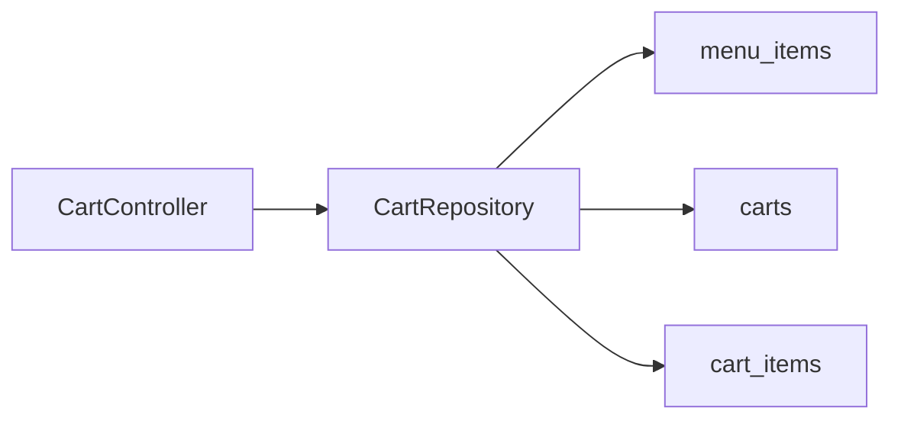

# Fillos — Cart module (backend)

**Path:** [backend/docs/modules/cart-module.md](cart-module.md)  
**Last updated:** 2026-04-12  
**Purpose:** Authenticated cart. **Testing steps:** [`../testing/customer-api-testing.md#3-cart`](../testing/customer-api-testing.md#3-cart).

---

## 1. What this module does

- One cart per user; merge duplicate `menuItemId` lines.
- Live prices from `menu_items`.
- **Bearer JWT** on every route; only **available** items in **active** categories.

**Checkout:** [order-module](order-module.md) — `POST /api/v1/orders` copies the cart into an order and clears lines. Optional delivery snapshot from [address-module](address-module.md).

---

## 2. Prerequisites

Customer `accessToken` + a `menuItemId` from public menu GETs ([flow](../testing/api-flow-mindmap.md)).

---

## 3. Database (Flyway)

| Table | Meaning |
| --- | --- |
| `carts` | One row per user |
| `cart_items` | Lines; unique `(cart_id, menu_item_id)` |

[V2__cart.sql](../../src/main/resources/db/migration/V2__cart.sql).

---

## 4. HTTP API (reference only)

| Method | Path | Auth | Controller | Success | Fail |
| --- | --- | --- | --- | --- | --- |
| `GET` | `/api/v1/cart` | Bearer | `CartController.get` | `200` | `403` |
| `POST` | `/api/v1/cart/items` | Bearer | `CartController.addItem` | `204` | `400`, `403` |
| `PATCH` | `/api/v1/cart/items/{lineId}` | Bearer | `CartController.updateLine` | `204` | `403`, `404` |
| `DELETE` | `/api/v1/cart/items/{lineId}` | Bearer | `CartController.deleteLine` | `204` | `403`, `404` |
| `DELETE` | `/api/v1/cart` | Bearer | `CartController.clear` | `204` | `403` |

**How to test:** [customer-api-testing.md §3](../testing/customer-api-testing.md#3-cart).

---

## 5. File reference

[CartController.java](../../src/main/java/com/fillos/backend/cart/CartController.java), [CartRepository.java](../../src/main/java/com/fillos/backend/cart/CartRepository.java), [CartDtos.java](../../src/main/java/com/fillos/backend/cart/CartDtos.java).

---

## 6. Flow

---

## 7. Related docs

- [security-auth-module.md](security-auth-module.md)  
- [health-module.md](health-module.md)  
- [order-module.md](order-module.md)  
- [menu-module.md](menu-module.md)  
- [Testing index](../testing/README.md)

---

## 8. When to edit this doc

Checkout, new cart endpoints, or response shape changes.
