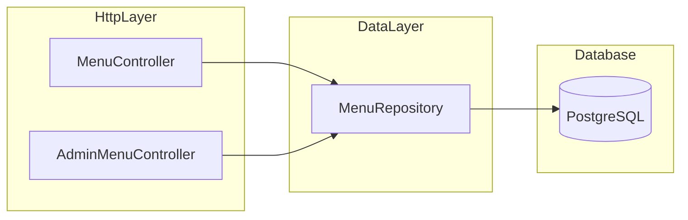

# Fillos — Menu module (backend)

**Document path:** [backend/docs/modules/menu-module.md](menu-module.md)  
**Last updated:** 2026-04-12  
**Purpose:** Menu HTTP reference (**§4** slim tables), deep file reference (**§5**). **How to test:** [`../testing/customer-api-testing.md`](../testing/customer-api-testing.md), [`../testing/admin-api-testing.md`](../testing/admin-api-testing.md), [`../testing/api-flow-mindmap.md`](../testing/api-flow-mindmap.md).

---

## 1. What this module does

The **menu module** lets you:

- **Publish a menu** (admin): create/update/delete **categories** and **items** in PostgreSQL.
- **Show the menu to customers** (public API): list active categories and only **available** items in active categories.

It does **not** yet include:

- Anything beyond **menu data** itself (ordering, cart, payments live in other modules).

**Security:** Admin HTTP routes for this module live under `/api/v1/admin/menu` and require a **JWT** with role `admin` (see global security configuration). Customer read routes under `/api/v1/menu` stay public.

**Tags:** Create/update item bodies may include `tags` (`string[]`); the repository persists them to PostgreSQL `TEXT[]` via JDBC `SqlTypeValue` + `Connection#createArrayOf("text", …)`. Reads still return `[]` when the column is null.

---

## 2. How the pieces connect (high level)

**Browser → backend (CORS):**  
`[SecurityConfig](../../src/main/java/com/fillos/backend/security/SecurityConfig.java)` registers **CORS** for `/api/**` (same localhost **Vite** origins as before) and **HTTP security** (JWT, public customer menu, protected admin). See [security-auth-module.md](security-auth-module.md) for auth routes and token usage.

---

## 3. Database (Flyway) relevant to menu

Menu tables are created in:

- `[backend/src/main/resources/db/migration/V1__init_core.sql](../../src/main/resources/db/migration/V1__init_core.sql)`

Relevant objects:

| Object            | Meaning                                                                                                                     |
| ----------------- | --------------------------------------------------------------------------------------------------------------------------- |
| `menu_categories` | One row per menu section (e.g. Starters). `is_active` hides it from customers.                                              |
| `menu_items`      | One row per dish. `category_id` FK → `menu_categories`. `is_available` hides from customers. `tags` is `TEXT[]` (optional). |

---

## 4. HTTP API (reference only)

DTOs: [MenuDtos.java](../../src/main/java/com/fillos/backend/menu/MenuDtos.java).

### 4.1 Customer (`MenuController`)

| Method | Path | Auth | Controller | Success | Fail |
| --- | --- | --- | --- | --- | --- |
| `GET` | `/api/v1/menu/categories` | None | `MenuController.listCategories` | `200` | — |
| `GET` | `/api/v1/menu/categories/{id}/items` | None | `MenuController.listItems` | `200` | `404` |
| `GET` | `/api/v1/menu/items/{id}` | None | `MenuController.getItem` | `200` | `404` |

### 4.2 Admin (`AdminMenuController`)

| Method | Path | Auth | Controller | Success | Fail |
| --- | --- | --- | --- | --- | --- |
| `GET` | `/api/v1/admin/menu/categories` | Bearer admin | `AdminMenuController.listCategories` | `200` | `403` |
| `GET` | `/api/v1/admin/menu/categories/{id}/items` | Bearer admin | `AdminMenuController.listItems` | `200` | `403`, `404` |
| `POST` | `/api/v1/admin/menu/categories` | Bearer admin | `AdminMenuController.createCategory` | `201` | `403`, `400` |
| `PUT` | `/api/v1/admin/menu/categories/{id}` | Bearer admin | `AdminMenuController.updateCategory` | `204` | `403`, `404` |
| `DELETE` | `/api/v1/admin/menu/categories/{id}` | Bearer admin | `AdminMenuController.deleteCategory` | `204` | `403`, `404` |
| `POST` | `/api/v1/admin/menu/items` | Bearer admin | `AdminMenuController.createItem` | `201` | `403`, `400` |
| `PUT` | `/api/v1/admin/menu/items/{id}` | Bearer admin | `AdminMenuController.updateItem` | `204` | `403`, `400`, `404` |
| `PATCH` | `/api/v1/admin/menu/items/{id}/availability` | Bearer admin | `AdminMenuController.patchAvailability` | `204` | `403`, `404` |
| `DELETE` | `/api/v1/admin/menu/items/{id}` | Bearer admin | `AdminMenuController.deleteItem` | `204` | `403`, `404` |

**How to test (bodies, `Location`, Postman):** [customer-api-testing §1](../testing/customer-api-testing.md#1-public-no-token), [admin-api-testing §2](../testing/admin-api-testing.md#2-admin-menu-routes).

**Note:** `201` admin create responses have an empty body; read **`Location`** for the new UUID.

---

## 5. File-by-file reference

Paths below are relative to the backend project root `[backend/](../../)`.

### 5.1 `[src/main/java/com/fillos/backend/menu/MenuDtos.java](../../src/main/java/com/fillos/backend/menu/MenuDtos.java)`

**Package:** `com.fillos.backend.menu` — keeps all menu request/response shapes in one place (fewer files while learning).

**Imports (top to bottom):**

| Import                                          | Why it is needed                                                                               |
| ----------------------------------------------- | ---------------------------------------------------------------------------------------------- |
| `jakarta.validation.constraints.NotBlank`       | Ensures string fields are not empty/whitespace when `@Valid` is used on controller parameters. |
| `jakarta.validation.constraints.NotNull`        | Ensures required objects (e.g. `UUID`, `BigDecimal`) are present in JSON bodies.               |
| `jakarta.validation.constraints.PositiveOrZero` | Ensures numeric ordering fields are `>= 0`.                                                    |
| `java.math.BigDecimal`                          | Money fields (`price`, `discountedPrice`) — avoids floating-point rounding errors.             |
| `java.util.List` / `java.util.UUID`             | Collection of tags and primary keys.                                                           |

**Class:** `public final class MenuDtos`

| Member               | Kind                | Meaning                                                                                   |
| -------------------- | ------------------- | ----------------------------------------------------------------------------------------- |
| `private MenuDtos()` | Private constructor | Stops people from instantiating this “namespace” class; only the nested records are used. |

**Nested records (each is an immutable data carrier):**

| Record                         | JSON role    | Fields / validation                                                                                                                                 |
| ------------------------------ | ------------ | --------------------------------------------------------------------------------------------------------------------------------------------------- |
| `MenuCategoryResponse`         | Response     | `id`, `name`, `displayOrder`, `imageUrl`, `active` (maps from DB `is_active`).                                                                      |
| `MenuItemResponse`             | Response     | Full item row for API consumers. `tags` is always a list (empty if DB null).                                                                        |
| `CreateCategoryRequest`        | Request body | `name` `@NotBlank`; `displayOrder` `@PositiveOrZero`; optional `imageUrl`; `active`.                                                                |
| `UpdateCategoryRequest`        | Request body | Same shape as create, for PUT.                                                                                                                      |
| `CreateMenuItemRequest`        | Request body | `categoryId` required; `name`, `price` required; optional description/prices/image/calories/`tags` (persisted as `TEXT[]`); booleans and ordering. |
| `UpdateMenuItemRequest`        | Request body | Same as create for full item replace.                                                                                                               |
| `PatchItemAvailabilityRequest` | Request body | Single boolean `available` for PATCH.                                                                                                               |

---

### 5.2 `[src/main/java/com/fillos/backend/menu/MenuRepository.java](../../src/main/java/com/fillos/backend/menu/MenuRepository.java)`

**Package:** `com.fillos.backend.menu`

**Imports:**

| Import                                         | Why                                                                                          |
| ---------------------------------------------- | -------------------------------------------------------------------------------------------- |
| `MenuDtos.*` request types                     | Method parameters for insert/update.                                                         |
| `MenuDtos.*` response types                    | Return types for queries.                                                                    |
| `java.sql.Array`, `Connection`, `ResultSet`, `SQLException` | Read `TEXT[]`; write tags via `SqlTypeValue` + `Connection#createArrayOf`.                    |
| `SqlTypeValue`                                 | Binds Postgres `TEXT[]` parameters on insert/update.                                           |
| `Arrays`, `Collections`, `List`, `Map`, `UUID` | Collections and named SQL parameters.                                                        |
| `RowMapper`                                    | Maps each JDBC `ResultSet` row → `MenuCategoryResponse` / `MenuItemResponse`.                |
| `MapSqlParameterSource`                        | Named parameters for INSERT/UPDATE (readable SQL).                                           |
| `NamedParameterJdbcTemplate`                   | Spring JDBC helper used for **all** SQL in this module.                                      |
| `@Repository`                                  | Spring stereotype: registers this class as a bean and ties it to JDBC exception translation. |

**Class:** `public class MenuRepository`

| Member                                            | Kind                                  | Meaning                                                                            |
| ------------------------------------------------- | ------------------------------------- | ---------------------------------------------------------------------------------- |
| `private final NamedParameterJdbcTemplate jdbc`   | Field                                 | Injected by Spring; used for every query/update.                                   |
| `MenuRepository(NamedParameterJdbcTemplate jdbc)` | Constructor                           | Spring calls this to create the bean (constructor injection).                      |
| `readTags(ResultSet rs)`                          | `private static` method               | Converts SQL `tags` array → `List<String>`; null/empty-safe.                       |
| `sqlTextArray(List<String>)`                     | `private static` method               | Builds JDBC `SqlTypeValue` for `TEXT[]` writes.                                  |
| `CATEGORY_ROW`                                    | `private static final RowMapper<...>` | Maps columns `id,name,display_order,image_url,is_active` → `MenuCategoryResponse`. |
| `ITEM_ROW`                                        | `private static final RowMapper<...>` | Maps a joined/selected item row → `MenuItemResponse`, including `readTags`.        |

**Public methods (grouped by use case):**

| Method                                      | Returns                      | SQL idea                                                                   |
| ------------------------------------------- | ---------------------------- | -------------------------------------------------------------------------- |
| `listActiveCategoriesForCustomer`           | `List<MenuCategoryResponse>` | `WHERE is_active = TRUE`                                                   |
| `listAvailableItemsForCustomer(categoryId)` | `List<MenuItemResponse>`     | Join category; `is_available` + category active                            |
| `findAvailableItemForCustomer(itemId)`      | `MenuItemResponse` or `null` | Same rules as list, single row                                             |
| `listAllCategoriesForAdmin`                 | `List<MenuCategoryResponse>` | No `is_active` filter (admin sees hidden categories)                       |
| `listAllItemsForAdmin(categoryId)`          | `List<MenuItemResponse>`     | All items in category (available or not)                                   |
| `insertCategory`                            | new UUID                     | `INSERT` with generated id                                                 |
| `updateCategory`                            | rows affected                | `UPDATE ... WHERE id`                                                      |
| `deleteItemsInCategory`                     | rows affected                | `DELETE` all items in category (needed before deleting category due to FK) |
| `deleteCategory`                            | rows affected                | `DELETE` category row                                                      |
| `categoryExists`                            | boolean                      | `COUNT(*)` for admin checks                                                |
| `categoryExistsAndActiveForCustomer`        | boolean                      | `COUNT(*)` with `is_active = TRUE` for customer                            |
| `insertItem`                                | new UUID                     | `INSERT` including `tags` (`TEXT[]`)                                       |
| `updateItem`                                | rows affected                | `UPDATE` including `tags`                                                  |
| `patchItemAvailability`                     | rows affected                | `UPDATE is_available` only                                                 |
| `deleteItem`                                | rows affected                | `DELETE` item                                                              |
| `findItemForAdmin`                          | `MenuItemResponse` or `null` | Load any item row for existence checks                                     |

---

### 5.3 `[src/main/java/com/fillos/backend/menu/MenuController.java](../../src/main/java/com/fillos/backend/menu/MenuController.java)`

**Package:** `com.fillos.backend.menu`

**Imports:**

| Import                                                           | Why                                                                        |
| ---------------------------------------------------------------- | -------------------------------------------------------------------------- |
| `MenuDtos.MenuCategoryResponse`, `MenuItemResponse`              | JSON response types returned to the browser.                               |
| `List`, `UUID`                                                   | Collection return type and path variable type.                             |
| `ResponseEntity`                                                 | Lets us return **404** when a resource should not be visible to customers. |
| `GetMapping`, `PathVariable`, `RequestMapping`, `RestController` | Declares REST endpoints under `/api/v1/menu`.                              |

**Class:** `@RestController @RequestMapping("/api/v1/menu") public class MenuController`

| Member                                          | Meaning                                                                                         |
| ----------------------------------------------- | ----------------------------------------------------------------------------------------------- |
| `private final MenuRepository menuRepository`   | Dependency injected by Spring.                                                                  |
| `MenuController(MenuRepository menuRepository)` | Constructor injection.                                                                          |
| `listCategories()`                              | `GET /categories` → delegates to repository; always 200 + list (may be empty).                  |
| `listItems(categoryId)`                         | `GET /categories/{id}/items` → 404 if category missing/inactive for customer; else 200 + items. |
| `getItem(itemId)`                               | `GET /items/{id}` → 404 if not found / not available / inactive category; else 200 + item.      |

---

### 5.4 `[src/main/java/com/fillos/backend/menu/AdminMenuController.java](../../src/main/java/com/fillos/backend/menu/AdminMenuController.java)`

**Package:** `com.fillos.backend.menu`

**Imports:**

| Import                                          | Why                                                      |
| ----------------------------------------------- | -------------------------------------------------------- |
| All `MenuDtos.*` used                           | Request/response types for admin operations.             |
| `jakarta.validation.Valid`                      | Triggers validation annotations on request records.      |
| `URI`                                           | Builds `Location` header URL on `201 Created`.           |
| `List`, `UUID`                                  | Types for collections and IDs.                           |
| `ResponseEntity`                                | Returns `200`, `201`, `204`, `400`, `404` appropriately. |
| `Delete/Get/Patch/Post/Put` mapping annotations | REST verb routing.                                       |
| `RequestBody`                                   | Binds JSON body → record.                                |
| `RestController`, `RequestMapping`              | Base path `/api/v1/admin/menu`.                          |

**Class:** `@RestController @RequestMapping("/api/v1/admin/menu") public class AdminMenuController`

| Member                                        | Meaning                                                                                                           |
| --------------------------------------------- | ----------------------------------------------------------------------------------------------------------------- |
| `private final MenuRepository menuRepository` | Same repository as customer controller; **shared data layer**.                                                    |
| `listCategories`                              | Admin view of all categories.                                                                                     |
| `listItems`                                   | All items in a category; 404 if category id unknown.                                                              |
| `createCategory`                              | Validates body; inserts; returns `201` with `Location` (URL includes new id).                                     |
| `updateCategory`                              | `204` on success; `404` if id not found.                                                                          |
| `deleteCategory`                              | Deletes child items first, then category; `404` if category missing.                                              |
| `createItem`                                  | `400` if `categoryId` invalid; `201` with `Location` pointing at **public** item URL (`/api/v1/menu/items/{id}`). |
| `updateItem`                                  | Checks item exists, category exists; `404`/`400`/`204`.                                                           |
| `patchAvailability`                           | Small partial update for toggling stock/availability.                                                             |
| `deleteItem`                                  | `404` if nothing deleted.                                                                                         |

---

### 5.5 Shared: CORS + HTTP security

CORS and Spring Security live in `[SecurityConfig](../../src/main/java/com/fillos/backend/security/SecurityConfig.java)` (package `com.fillos.backend.security`). It allows browser apps on the listed localhost Vite origins to call `/api/**` and enforces JWT rules for admin vs public routes. Full endpoint matrix: [security-auth-module.md](security-auth-module.md).

---

## 6. Maintenance — when to edit this document

Update **§4**, **§5**, and the [**testing**](../testing/) docs when endpoints, DTOs, SQL, or security rules change.

---

## 7. Testing docs

| Doc | Use for |
| --- | --- |
| [customer-api-testing.md](../testing/customer-api-testing.md) | Public menu GETs |
| [admin-api-testing.md](../testing/admin-api-testing.md) | Admin menu CRUD, env, production checklist |
| [api-flow-mindmap.md](../testing/api-flow-mindmap.md) | Order of calls |
| [README.md](../testing/README.md) | Index |

---

## 8. Related module docs

- [security-auth-module.md](security-auth-module.md)  
- [health-module.md](health-module.md)  
- [cart-module.md](cart-module.md)  
- [order-module.md](order-module.md)

---

## 9. When to edit this doc

Endpoints, DTOs, Flyway menu tables, or global security for admin vs customer menu.
