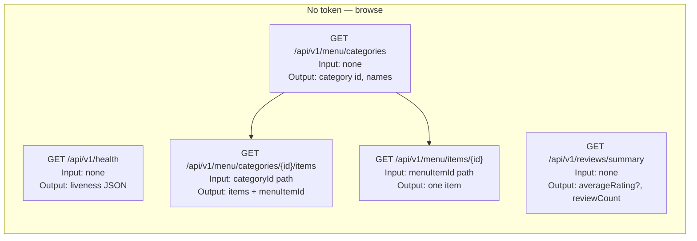
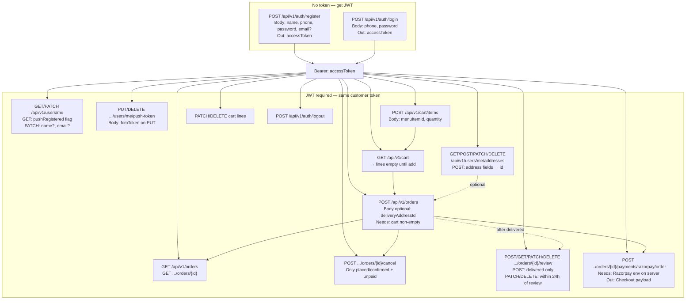
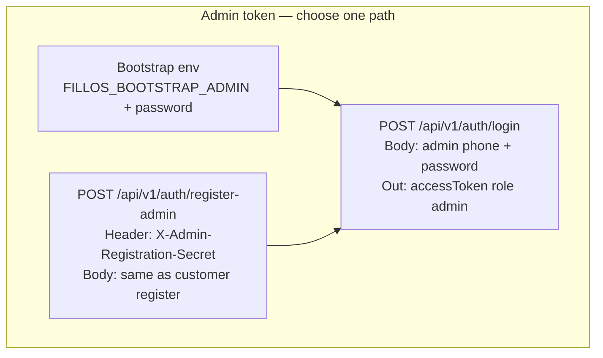
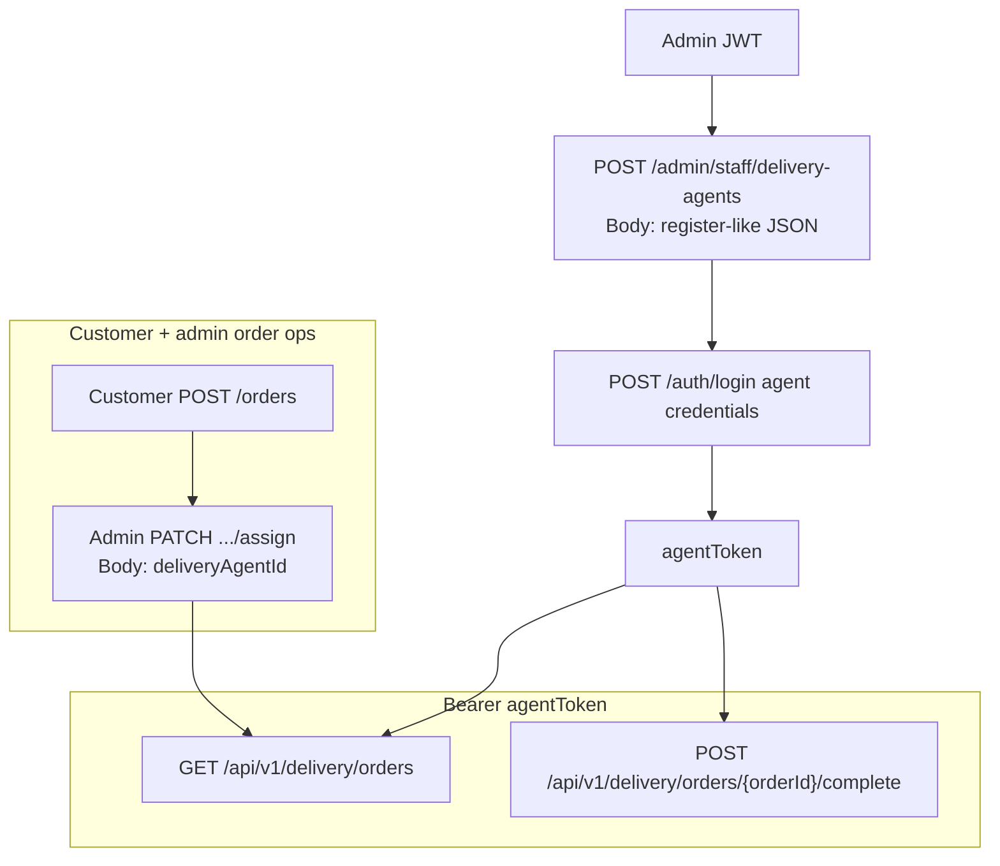

# API flow — mind maps and test order (Fillos backend)

**Audience:** testers, developers, PMs doing API checks.  
**Pair with:** step-by-step tables in [customer-api-testing.md](customer-api-testing.md), [admin-api-testing.md](admin-api-testing.md), [delivery-api-testing.md](delivery-api-testing.md).

This doc answers: **what to call first**, **why** (dependencies between modules), **what each call needs** (auth, path params, JSON bodies), and **suggested order** so you do not hit `403` / empty cart / missing UUID surprises.

---

## 1. Legend (read once)

| Symbol / term | Meaning |
| --- | --- |
| **No token** | No `Authorization` header. Only health, public menu, **`GET /api/v1/reviews/summary`**, auth register/login/register-admin (where enabled), and **`POST /api/v1/webhooks/razorpay`** (verified with Razorpay HMAC, not JWT). |
| **Bearer** | Header `Authorization: Bearer <accessToken>` from `POST /auth/register` or `POST /auth/login`. |
| **Why menu → cart** | `POST /api/v1/cart/items` requires a real **`menuItemId`** for an **available** item in an **active** category. You get that UUID from public menu GETs, or from admin menu `Location` after creating an item. |
| **Why auth before cart** | `SecurityConfig` protects `/api/v1/cart/**`. Without register/login you get **`403`**, not an empty JSON cart. |
| **Why cart before order** | `POST /api/v1/orders` snapshots the **current cart lines**. Empty cart → **`400` "Cart is empty"**. |
| **Addresses optional** | Checkout works with no body. If you want `deliveryAddressSnapshot` on the order, create addresses under `/api/v1/users/me/addresses` first, then send `{"deliveryAddressId":"<uuid>"}` on checkout. |

There is **no public “search” API** in this slice; customers discover items via **categories → items** (or single item by id).

---

## 2. Customer side — what the user can do and in what order

### 2.1 Story (first-time tester path)

1. **Browse menu (no account)** — `GET /menu/categories`, then `GET .../categories/{id}/items` or `GET .../menu/items/{id}`. **Input:** category UUID in path (from step 1). **Output:** item objects including **`id`** → save as `menuItemId`. Optionally **`GET /api/v1/reviews/summary`** for global rating stats (no token).
2. **Register or login** — You **cannot** call cart, profile (`/users/me`), addresses, or orders without a JWT. **`POST /api/v1/auth/register`** (new user) or **`POST /api/v1/auth/login`**. **Input:** JSON `name`, `email?`, `phone`, `password` (register) or `phone`, `password` (login). **Output:** `accessToken` → use as Bearer for everything below.
3. **Optional: profile** — `GET` / `PATCH /api/v1/users/me` to confirm token works.
4. **Cart** — `GET /api/v1/cart` returns **empty** lines until you **`POST /api/v1/cart/items`** with `{"menuItemId":"...","quantity":n}`. **Input:** `menuItemId` from §1. **Output:** `204`; then `GET /cart` shows `lineId`, quantities, subtotal.
5. **Optional: saved addresses** — `POST /api/v1/users/me/addresses` (see [address-module](../modules/address-module.md)). **Output:** address `id` for checkout.
6. **Checkout** — `POST /api/v1/orders` with optional body `{"deliveryAddressId":"<uuid>","customerNote":"…"}`. **Requires:** non-empty cart. **Output:** order with lines, `paymentStatus: unpaid`, optional `customerNote`, cart cleared.
7. **(Optional) Razorpay online pay** — With `RAZORPAY_ENABLED=true` and keys set, **`POST /api/v1/orders/{orderId}/payments/razorpay/order`** returns Checkout fields (`keyId`, `razorpayOrderId`, `amount` in paise for INR, …). After the customer pays in Razorpay Checkout, Razorpay calls **`POST /api/v1/webhooks/razorpay`** (no Bearer); on `payment.captured` the order becomes **`paid`**. See [razorpay-module.md](../modules/razorpay-module.md).
8. **Order history** — `GET /api/v1/orders`, `GET /api/v1/orders/{orderId}` (reflects `paid` after webhook or admin **`PATCH .../payment`**).
9. **Logout** — `POST /api/v1/auth/logout` invalidates token (`tv` claim).

### 2.2 Customer mind map — public + where IDs come from

### 2.3 Customer mind map — auth then protected APIs

**Why the links:** `POST /cart/items` does not return the cart; follow with **`GET /cart`** to read `lineId` for PATCH/DELETE. Checkout **reads the cart in the DB** then clears it—order does not carry a cart payload in the POST body (except optional address id).

### 2.4 Customer — recommended API test sequence (checklist)

| Step | Action | If you skip it |
| --- | --- | --- |
| 1 | Public menu GETs | No valid `menuItemId` for cart |
| 2 | Register or login | `403` on cart, addresses, orders, profile |
| 3 | `POST /cart/items` at least once | `POST /orders` → `400` Cart is empty |
| 4 | (Optional) addresses CRUD | Checkout still works; snapshot fields empty |
| 5 | `POST /orders` | — |
| 6 | (Optional) Razorpay create + Dashboard webhook to `/api/v1/webhooks/razorpay` | Else use admin **`PATCH .../payment`** for COD |
| 7 | `GET /orders` / `GET /orders/{id}` | — |

---

## 3. Admin side — provisioning, menu, orders, staff

### 3.1 Story

1. **Get an admin JWT** (pick one path):  
   - **A)** Env bootstrap admin → **`POST /auth/login`** with bootstrap phone + password.  
   - **B)** **`POST /auth/register-admin`** with header **`X-Admin-Registration-Secret`** matching env (feature must be enabled); same JSON shape as customer register.  
   Without this, every **`/api/v1/admin/**`** call returns **`403`** (or `404` for disabled register-admin).
2. **Menu (before customer E2E)** — Create categories and items so the public menu and cart have data. **`POST .../admin/menu/categories`** → read **`Location`** for `categoryId`. **`POST .../admin/menu/items`** with that `categoryId` → read **`Location`** for `menuItemId` (or use admin list GETs).
3. **Orders** — After at least one **customer checkout**, **`GET /api/v1/admin/orders`** lists rows. **`PATCH .../status`**, **`PATCH .../payment`**, **`PATCH .../assign`** need a real `orderId` from the list or from the customer’s checkout response.
4. **Reviews (optional)** — After a delivered order has a customer review, **`GET /api/v1/admin/reviews`** lists all reviews with phones for support; **`DELETE /api/v1/admin/reviews/{reviewId}`** removes one row (moderation).
5. **Staff** — **`POST /api/v1/admin/staff/delivery-agents`** creates a delivery user; agent then uses **`POST /auth/login`** (same auth endpoint as customer) to get **`agentToken`** for delivery routes.

### 3.2 Admin mind map — how admin JWT is obtained

### 3.3 Admin mind map — what admin can call with Bearer adminToken

```mermaid
flowchart TB
  Tadm["Bearer adminToken"]

  subgraph menu [Admin menu CRUD]
    AM1["GET categories / items"]
    AM2["POST/PUT/DELETE categories"]
    AM3["POST/PUT/PATCH/DELETE items<br/>POST body includes categoryId"]
  end

  subgraph orders [Admin orders]
    AO1["GET /admin/orders?limit&offset"]
    AO2["GET /admin/orders/{id}"]
    AO3["PATCH .../status JSON status"]
    AO4["PATCH .../payment JSON paymentStatus"]
    AO5["PATCH .../assign JSON deliveryAgentId"]
  end

  subgraph staff [Admin staff]
    ST1["GET/POST /admin/staff/delivery-agents<br/>POST body like register"]
  end

  subgraph reviews [Admin reviews]
    AR1["GET /admin/reviews?limit&offset"]
    AR2["DELETE /admin/reviews/{reviewId}"]
  end

  Tadm --> AM1
  Tadm --> AM2
  Tadm --> AM3
  Tadm --> AO1
  Tadm --> AO2
  Tadm --> AO3
  Tadm --> AO4
  Tadm --> AO5
  Tadm --> AR1
  Tadm --> AR2
  Tadm --> ST1
```

**Module link:** menu vs public visibility — customer **`GET /menu/**`** only sees **active** categories and **available** items; admin sees all and can toggle **`PATCH .../items/{id}/availability`**.

### 3.4 Admin — recommended API test sequence

| Step | Action | Why first |
| --- | --- | --- |
| 1 | Obtain admin JWT | Unlocks all admin routes |
| 2 | Create category + item | Unblocks customer menu + cart tests |
| 3 | (Parallel) customer checkout | Creates rows for admin order list |
| 4 | `GET/PATCH` admin orders, payment, assign | Needs existing `orderId` |
| 5 | `GET /api/v1/admin/reviews` (optional `DELETE .../admin/reviews/{reviewId}`) | List after reviews exist; delete for moderation smoke test |
| 6 | Create delivery agent + assign | Unblocks delivery-agent tests |

---

## 4. Delivery agent side — depends on admin + customer

### 4.1 Story

1. Admin creates agent: **`POST /api/v1/admin/staff/delivery-agents`** (admin Bearer).  
2. Agent logs in: **`POST /api/v1/auth/login`** with agent phone + password → **`agentToken`** (role `delivery_agent`).  
3. Customer must have an order; admin **`PATCH .../assign`** with that agent’s **user `id`**.  
4. Agent **`GET /api/v1/delivery/orders`** sees active jobs; **`POST .../delivery/orders/{orderId}/complete`** marks delivered.

**Security:** `/api/v1/delivery/**` requires **`ROLE_DELIVERY_AGENT`**. A **customer** token on those URLs → **`403`**.

### 4.2 Delivery mind map

---

## 5. Full cross-role smoke (one pass through the system)

Use this when you want to touch **every major area** once:

1. **Admin:** JWT → create menu category + item (note `menuItemId`).  
2. **Customer:** Register/login → `GET` menu (sanity) → `POST /cart/items` → optional `POST` address → `POST /orders`.  
3. **Customer (optional):** `POST .../payments/razorpay/order` → pay in Razorpay test mode → webhook marks **`paid`**; *or* **Admin:** `PATCH .../payment` for COD.  
4. **Admin:** `GET` orders → `PATCH` status (optional) → `POST` staff delivery-agent (if none) → `PATCH` assign with agent user id.  
5. **Agent:** Login → `GET` delivery orders → `POST` complete.  
6. **Customer:** `GET` orders (see `delivered` / payment fields as applicable).

---

## 6. Where detail lives

| Topic | Doc |
| --- | --- |
| Every route, example JSON, status codes | [customer-api-testing.md](customer-api-testing.md), [admin-api-testing.md](admin-api-testing.md), [delivery-api-testing.md](delivery-api-testing.md) |
| Security / roles | [security-auth-module.md](../modules/security-auth-module.md) |
| Domain rules | [menu](../modules/menu-module.md), [cart](../modules/cart-module.md), [order](../modules/order-module.md), [address](../modules/address-module.md), [payment](../modules/payment-module.md), [delivery](../modules/delivery-module.md), [staff](../modules/staff-module.md) |

---

## 7. When to edit this doc

New modules (e.g. Razorpay), new public routes, or changed auth layout — add a subsection + a small diagram rather than growing one mega-chart.
