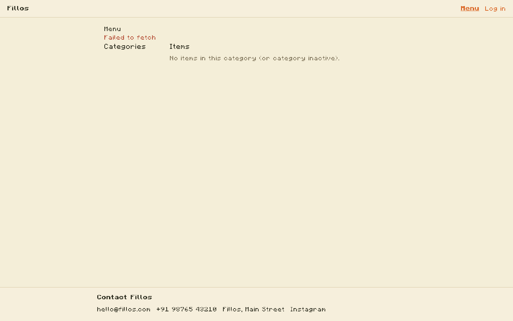
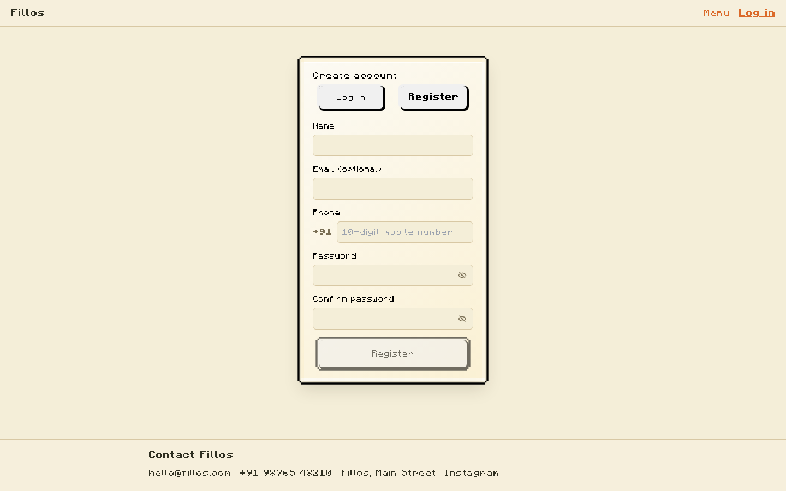
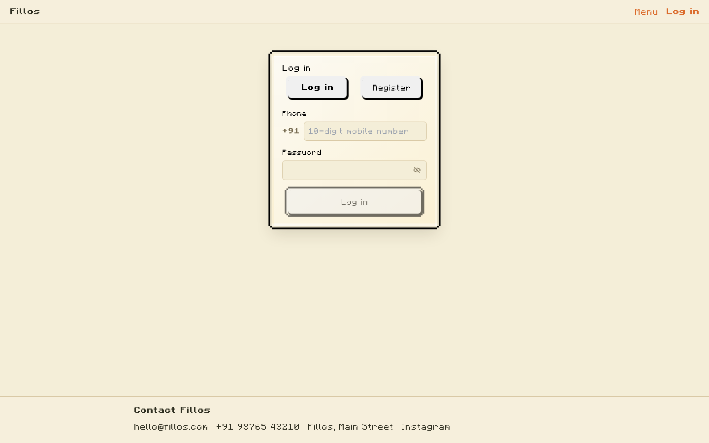

# Fillos Frontend Module Docs

This document tracks completed frontend pages, route access, and what each page currently shows.

## Base setup

- Frontend URL: `http://localhost:5173` (dev) or `http://localhost:4173` (preview build)
- Backend API default: `http://localhost:8080`
- API base can be overridden via `VITE_API_URL` in `.env.local`

## How to access pages

- Public pages (no login required):
  - `/menu`
  - `/login`
- Customer protected pages (JWT required):
  - `/profile`
  - `/cart`
  - `/checkout`
  - `/orders`
  - `/orders/:orderId`
- Admin-only page:
  - `/admin` (requires authenticated user with `role === "admin"`)

If unauthenticated, protected pages redirect to `/login`.
If non-admin, `/admin` redirects to `/menu`.

## Test users (seeded)

If backend Flyway seeds are applied (`V12` + `V13` + `V15`):

- Customer: phone `9995550001`, password `DummyPass1!`
- Admin: phone `9995550002`, password `DummyPass1!`

## Completed pages and UI behavior

### `MenuPage` (`/menu`)

- Lists categories and items from menu APIs.
- Shows pricing, veg/non-veg, availability.
- Supports add-to-cart action.
- Fetches and displays public review summary.

### `LoginPage` (`/login`)

- Login and register tabs.
- India phone input (10 digits) with visible `+91` prefix.
- Password policy feedback in register mode.
- Confirm password field in register mode.
- Password show/hide eye toggle with enlarged click area.

### `ProfilePage` (`/profile`)

- Displays current user profile data.
- Supports editing name/email.
- Supports address CRUD and default address selection.

### `CartPage` (`/cart`)

- Lists cart lines.
- Quantity update and remove item actions.
- Cart total and checkout navigation.

### `CheckoutPage` (`/checkout`)

- Shows checkout summary.
- Supports selecting saved address.
- Supports optional customer note submission.
- Places order via backend checkout API.

### `OrdersPage` (`/orders`)

- Lists user order history.
- Links to order detail view.

### `OrderDetailPage` (`/orders/:orderId`)

- Displays order lines, totals, status, payment status.
- Supports cancellation when order is in cancellable state.
- Includes Razorpay payload request helper for integration testing.

### `AdminPage` (`/admin`)

- Orders panel with filters and quick status/payment updates.
- Delivery assignment per order.
- Reviews list with rating filter and delete action.
- Delivery agent listing + create form.
- Menu category create/delete and item create/delete.
- Item availability toggle.

## UI Preview Screenshots

Screenshots were generated from the current frontend build and stored under `frontend/docs/assets`.

If backend is not reachable during capture, protected routes may show redirect/login state. In that case `login-error.png` is also generated.
