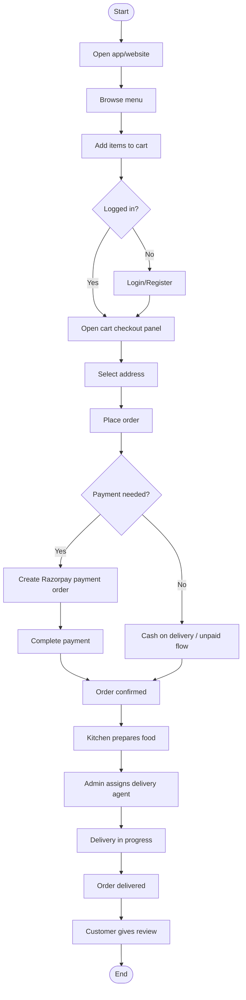
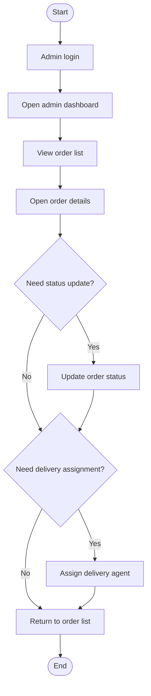
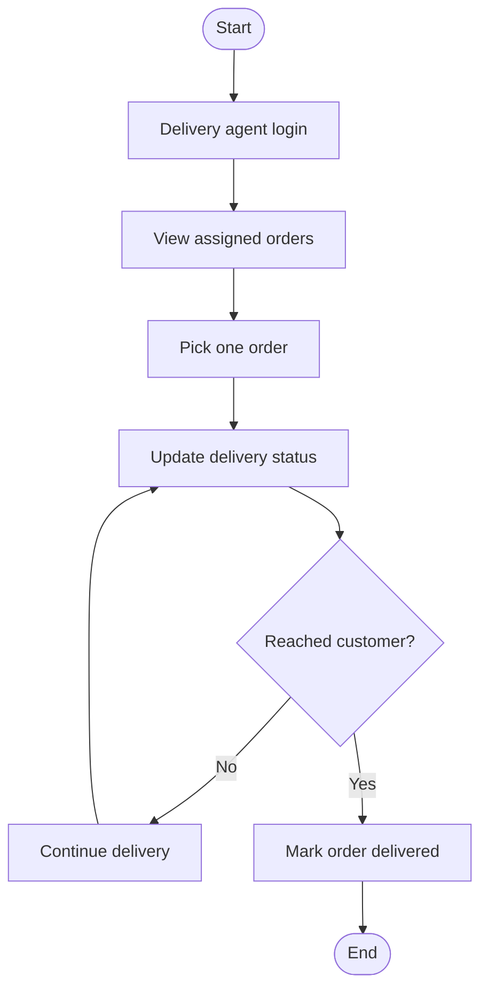
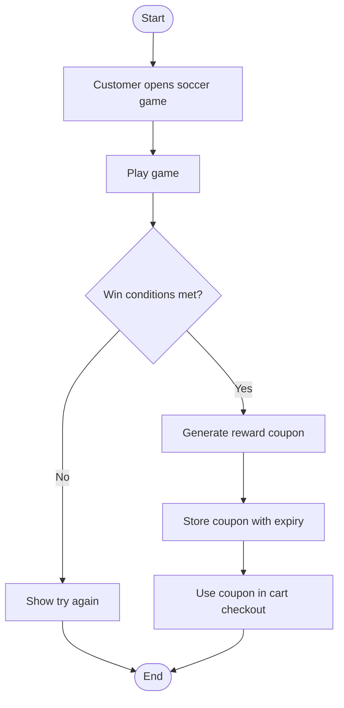

# Activity Diagram

This document explains **step-by-step actions** in simple language.
An activity diagram is like a flowchart showing what happens next.

## 1) Main Activity Flow (Customer Order Journey)

## 2) Split Activity A (Admin Order Management)

## 3) Split Activity B (Delivery Agent Flow)

## 4) Split Activity C (Implemented Soccer Reward Flow)

## Status legend

- <u>Implemented</u> = available in current backend/frontend.
- <u>Planned</u> = from design docs, not fully implemented yet.

## Plain-language summary

<u>The order flow from browsing menu to delivery and review is implemented.</u>
<u>Admin and delivery operational flows are implemented at a basic working level.</u>
<u>Soccer game activity flow is now implemented (single-game scope).</u>
