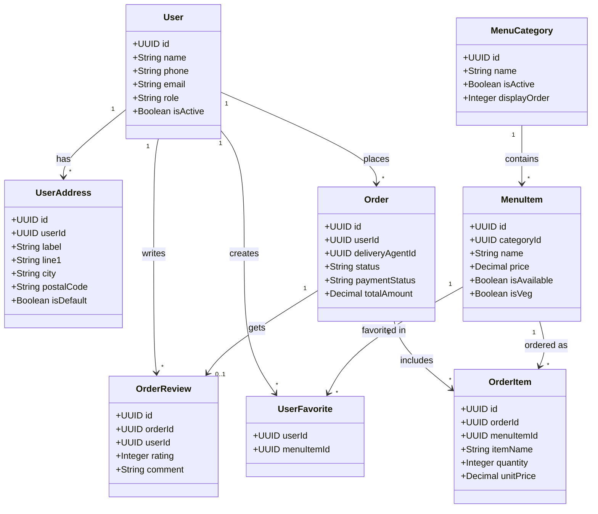
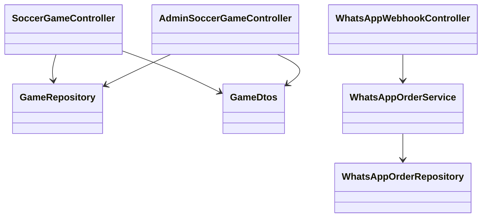

# Class Diagram

A class diagram shows the **main building blocks** of code and how they relate.
For non-technical readers: think of classes as "organized boxes of responsibility".

## 1) Domain Class Diagram (Core Data Model)

## 2) Application Class Diagram (Controller -> Service -> Repository style)

```mermaid
classDiagram
    class AuthController
    class UserProfileController
    class MenuController
    class AdminMenuController
    class CartController
    class OrderController
    class AdminOrderController
    class DeliveryController
    class OrderReviewController
    class AdminReviewsController
    class FavoritesController
    class OrderRazorpayController
    class RazorpayWebhookController

    class AuthService
    class MenuService
    class CartService
    class OrderService
    class ReviewService
    class FavoritesService
    class PaymentService

    class UserRepository
    class MenuRepository
    class CartRepository
    class OrderRepository
    class ReviewRepository
    class FavoritesRepository

    AuthController --> AuthService
    UserProfileController --> AuthService
    MenuController --> MenuService
    AdminMenuController --> MenuService
    CartController --> CartService
    OrderController --> OrderService
    AdminOrderController --> OrderService
    DeliveryController --> OrderService
    OrderReviewController --> ReviewService
    AdminReviewsController --> ReviewService
    FavoritesController --> FavoritesService
    OrderRazorpayController --> PaymentService
    RazorpayWebhookController --> PaymentService

    AuthService --> UserRepository
    MenuService --> MenuRepository
    CartService --> CartRepository
    OrderService --> OrderRepository
    ReviewService --> ReviewRepository
    FavoritesService --> FavoritesRepository
```

## 3) Split Class Diagram (Game + WhatsApp)

## Status legend

- <u>Implemented</u> = represented by current codebase modules.
- <u>Planned</u> = planned architecture from PDFs.

## Plain-language summary

<u>The project already has clear class-level separation for auth, menu, cart, orders, reviews, favorites, and payments.</u>
<u>Soccer game class group is implemented at controller/repository/DTO level.</u>
<u>WhatsApp class groups are still planned and documented for future implementation.</u>
