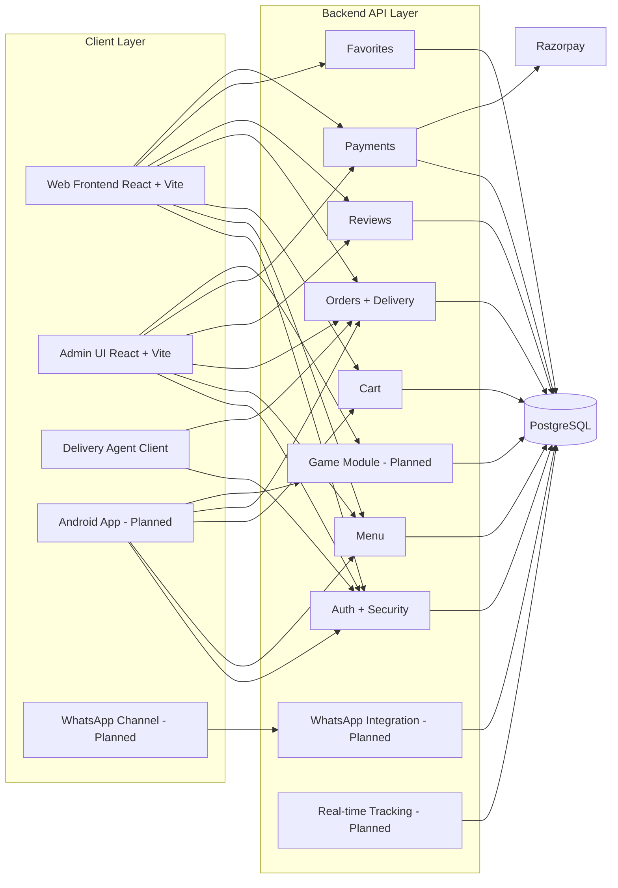
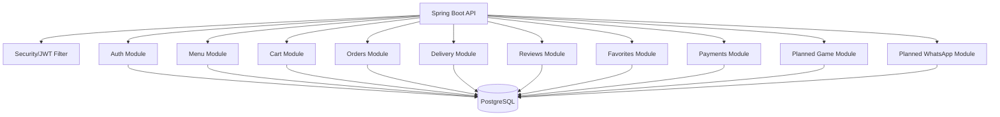
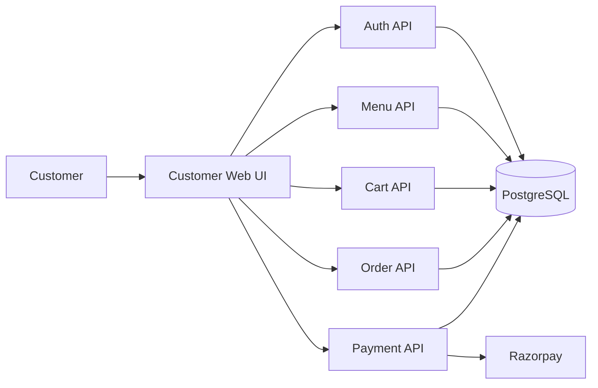
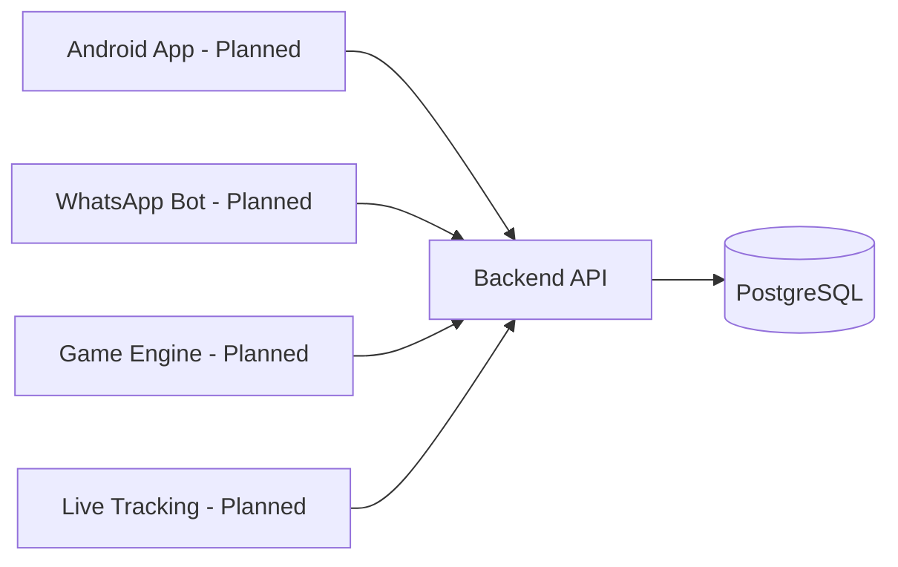

# Component Diagram

A component diagram shows the big parts of the system and how they connect.
For non-technical readers: this is the "system blocks and wires" view.

## 1) High-Level Component Diagram

## 2) Split Component A (Backend Internal Components)

## 3) Split Component B (Customer Ordering Components)

## 4) Split Component C (Planned Expansion Components)

## Status legend

- <u>Implemented</u> = existing components in current repo.
- <u>Planned</u> = design targets not fully implemented yet.

## Plain-language summary

<u>The current system already has working web/admin clients connected to modular backend APIs and PostgreSQL.</u>
<u>Payment integration with Razorpay exists through backend payment components.</u>
<u>Android app, WhatsApp channel, game engine, and full live tracking are planned component expansions.</u>
