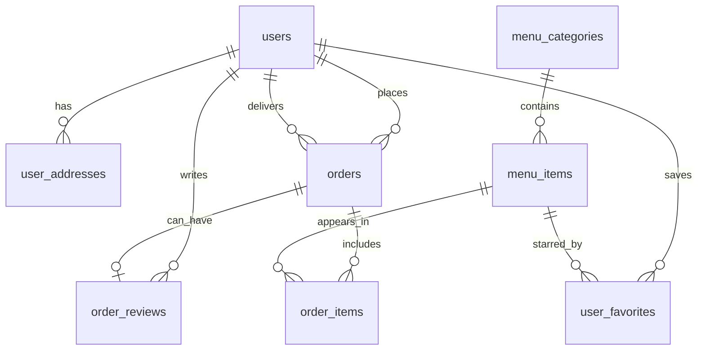
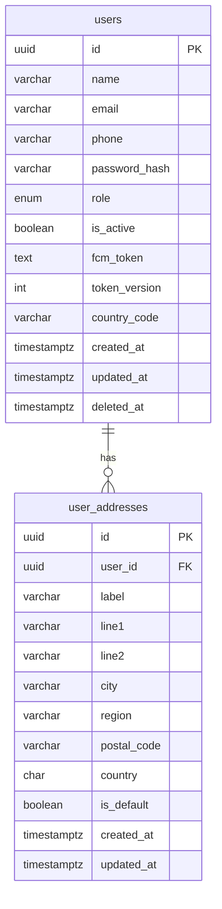
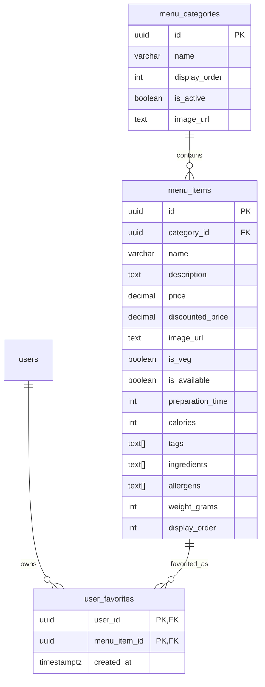
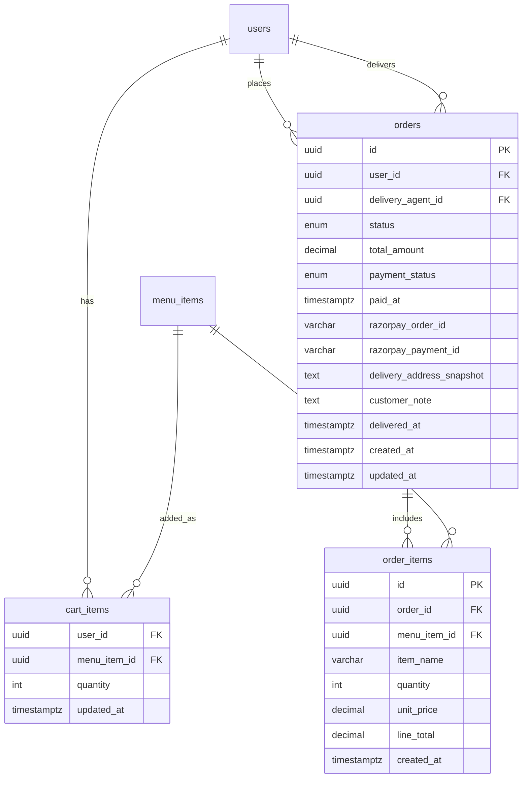
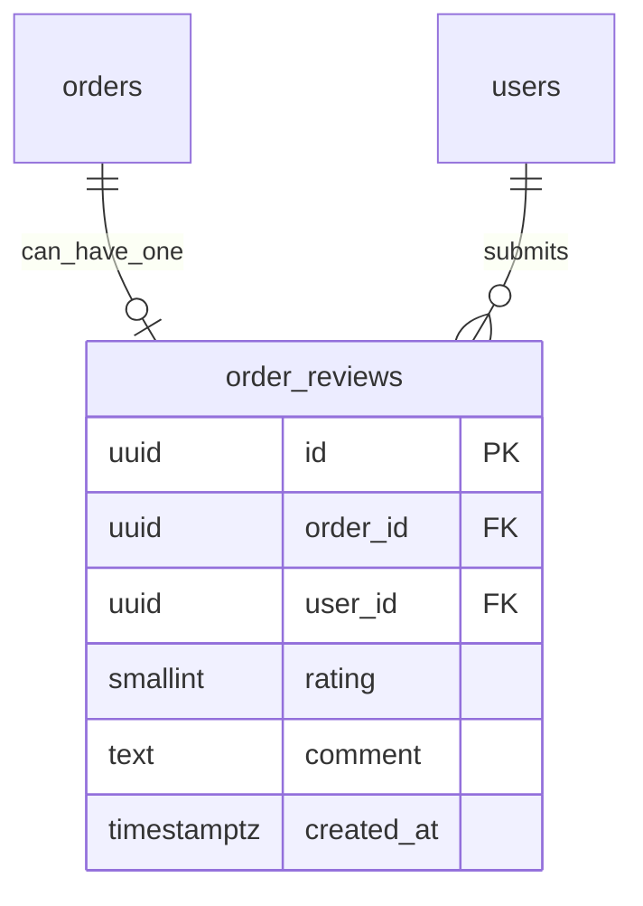
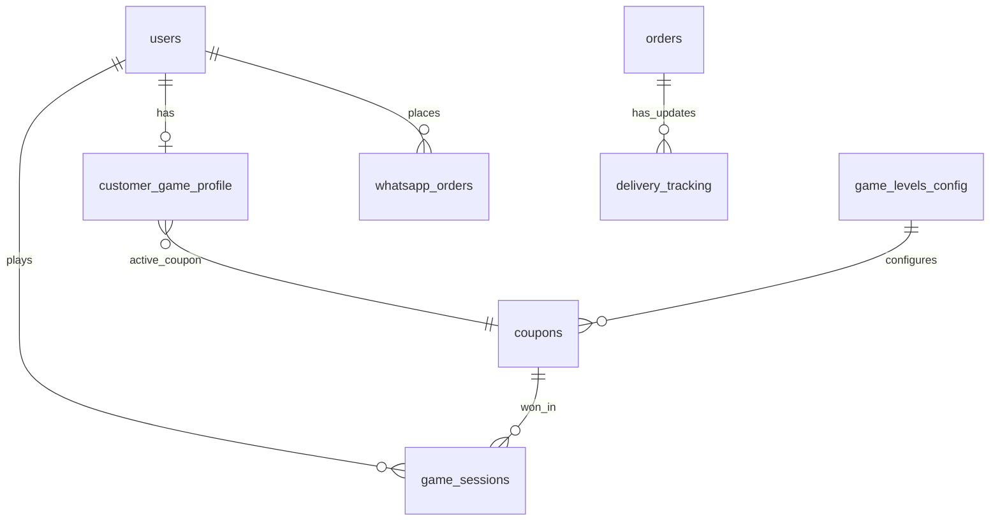

# Database Schema Diagram

This document explains the database in small, easy parts.
If one big diagram is hard to read, these split diagrams are better.

## 1) Core ER Diagram (High-Level)

## 2) Split ER A (Identity and Profile Data)

## 3) Split ER B (Menu and Favorites Data)

## 4) Split ER C (Cart and Ordering Data)

## 5) Split ER D (Reviews and Feedback Data)

## 6) Split ER E (Planned Schema Extensions)

## Status legend

- <u>Implemented</u> = table/entity exists in current migrations.
- <u>Planned</u> = appears in planning PDFs, not fully implemented in current DB.

## Plain-language summary

<u>Current database strongly supports users, menu, cart, orders, payments, reviews, and favorites.</u>
<u>Game-level entities, WhatsApp order entities, and richer live tracking entities are planned for future DB expansion.</u>
