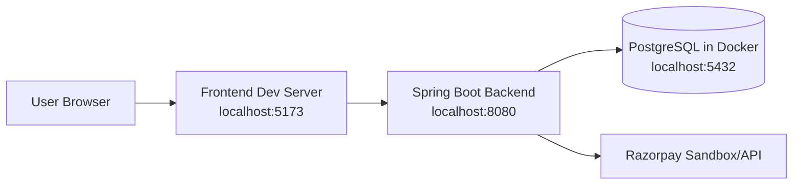
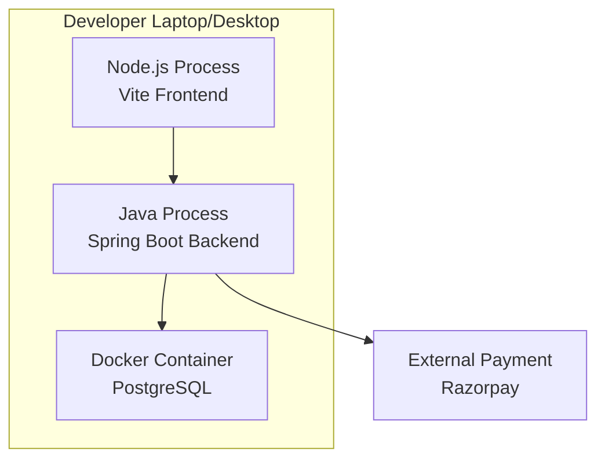
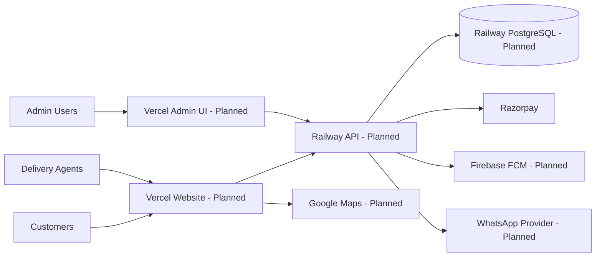
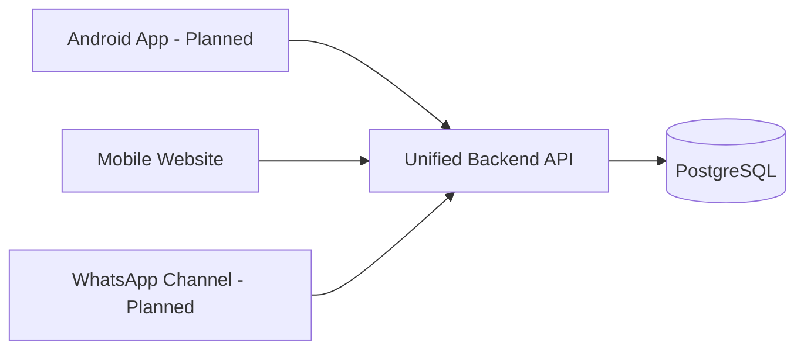

# Deployment Diagram

A deployment diagram shows **where the software runs** (machines/services) and how they connect.
For non-technical readers: this is the "which computer runs what" picture.

## 1) Current Local/Dev Deployment

## 2) Split Deployment A (Current Runtime Nodes)

## 3) Split Deployment B (Planned Production Deployment)

## 4) Split Deployment C (Planned Multi-Channel Expansion)

## Status legend

- <u>Implemented</u> = currently working in local/dev setup.
- <u>Planned</u> = production strategy from planning docs.

## Plain-language summary

<u>Today, frontend, backend, and PostgreSQL run locally with payment integration support.</u>
<u>The full cloud deployment model (Vercel/Railway/Firebase/WhatsApp providers) is a planned target architecture.</u>
