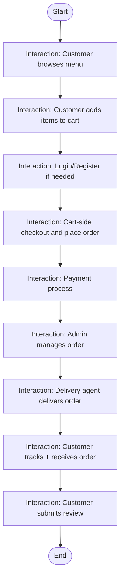
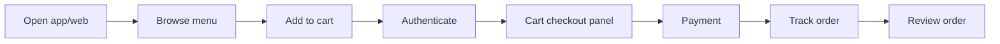
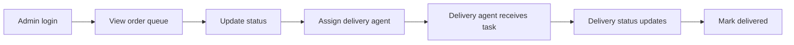
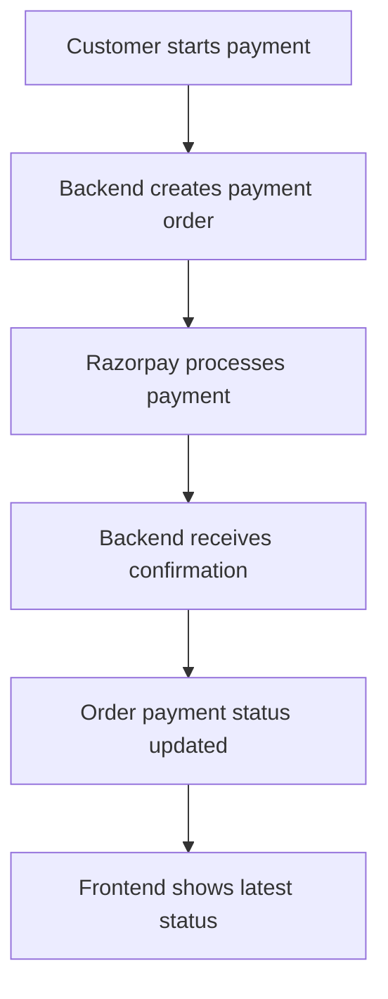
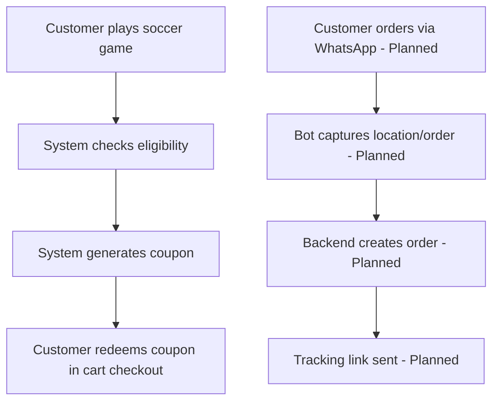

# Interaction Overview Diagram

An interaction overview diagram is a **big-picture map** of how different interactions connect.
For non-technical readers: this is a "storyboard" of the whole system journey.

## 1) Main Interaction Overview (End-to-End Story)

## 2) Split Overview A (Customer Interaction Path)

## 3) Split Overview B (Operations Interaction Path)

## 4) Split Overview C (Payment + Status Synchronization)

## 5) Split Overview D (Game + Future Interactions)

## Status legend

- <u>Implemented</u> = active interaction in current codebase.
- <u>Planned</u> = in design docs but not fully implemented yet.

## Plain-language summary

<u>The main interaction chain from browsing to ordering, operations, and review is already working.</u>
<u>Soccer game reward interaction is now implemented at basic level.</u>
<u>WhatsApp interaction chain remains a future interaction and is included for planning clarity.</u>
