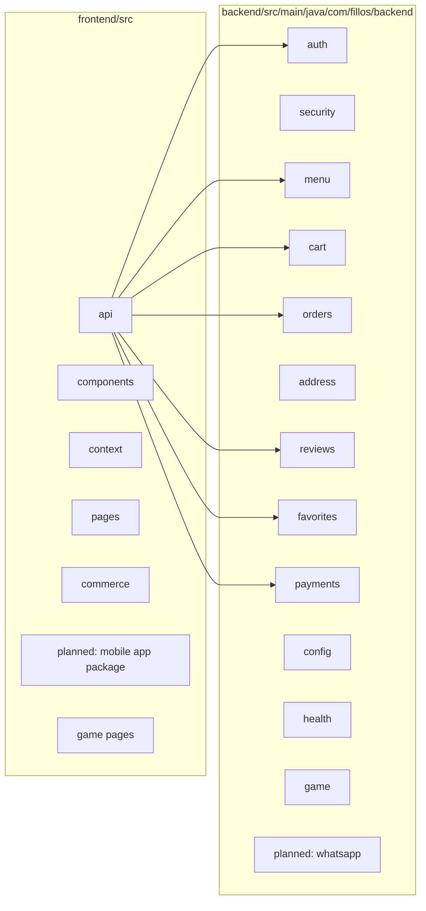
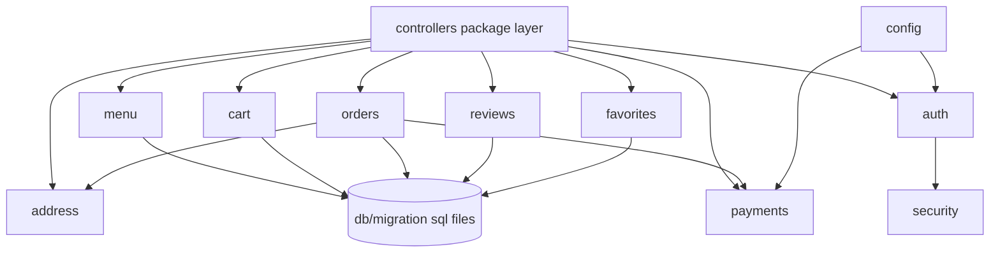
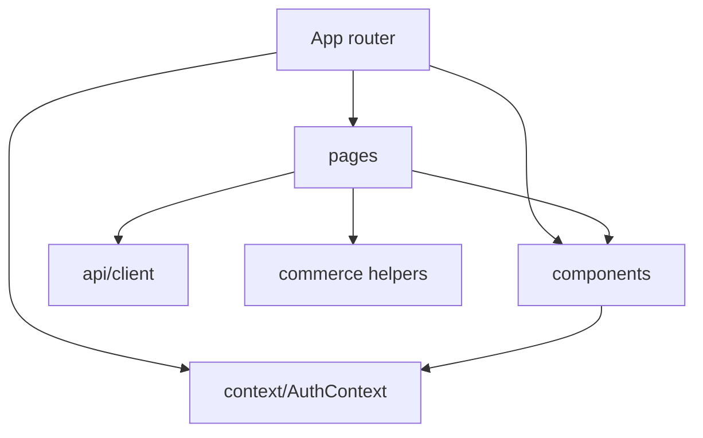
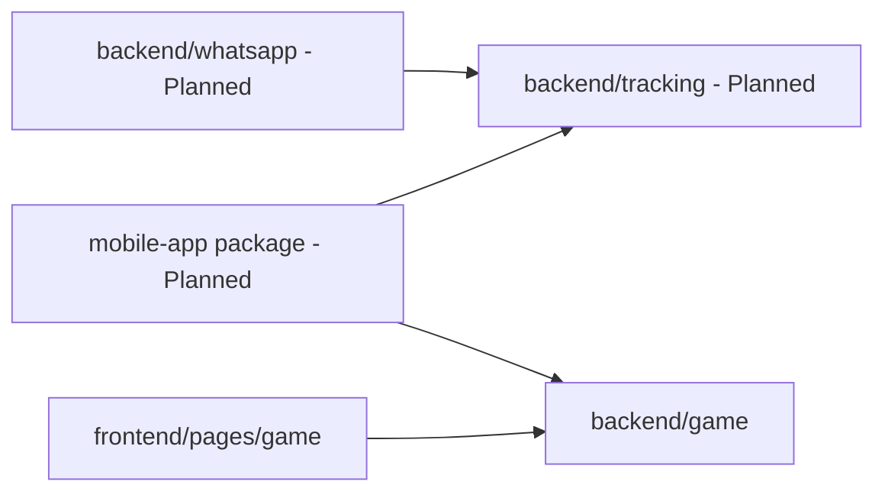

# Package Diagram

A package diagram shows how code is grouped into folders/modules.
For non-technical readers: this is the "which topic lives in which folder" map.

## 1) Main Package Diagram (Backend + Frontend)

## 2) Split Package A (Backend Package Relationships)

## 3) Split Package B (Frontend Package Relationships)

## 4) Split Package C (Extension Packages)

## Status legend

- <u>Implemented</u> = package/module exists in current repository.
- <u>Planned</u> = package/module documented for future work.

## Plain-language summary

<u>The codebase is already modular, with clear backend domain packages and frontend page/component separation.</u>
<u>Game-related backend and frontend packages are now present.</u>
<u>WhatsApp and deeper tracking package groups remain planned.</u>
