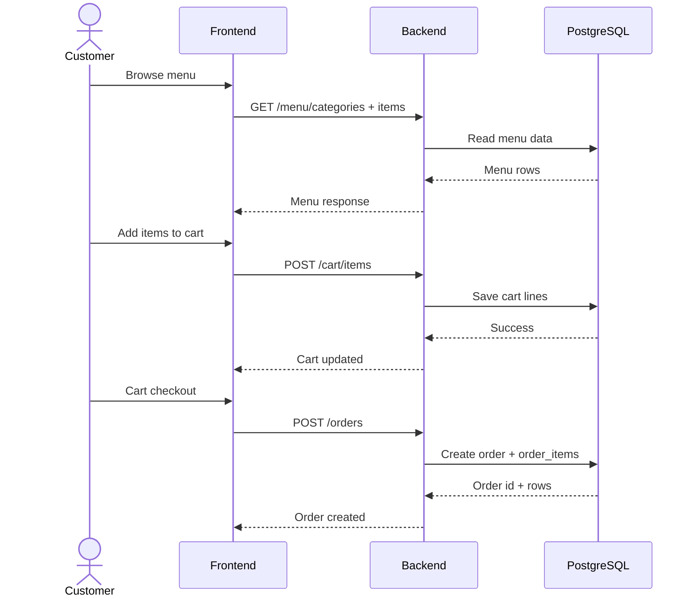
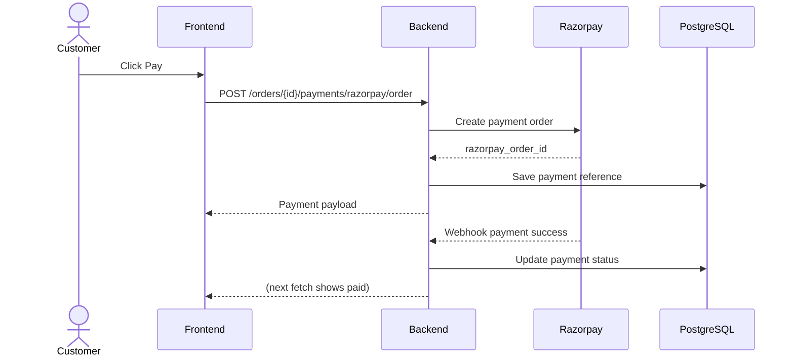
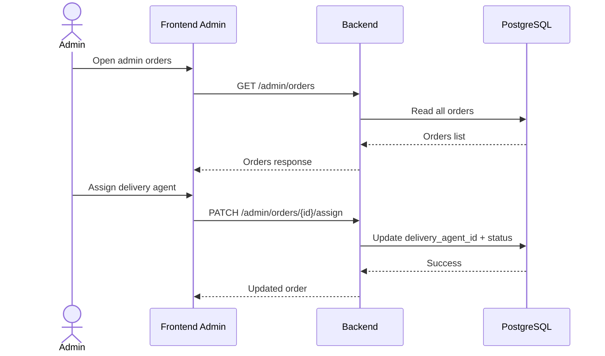
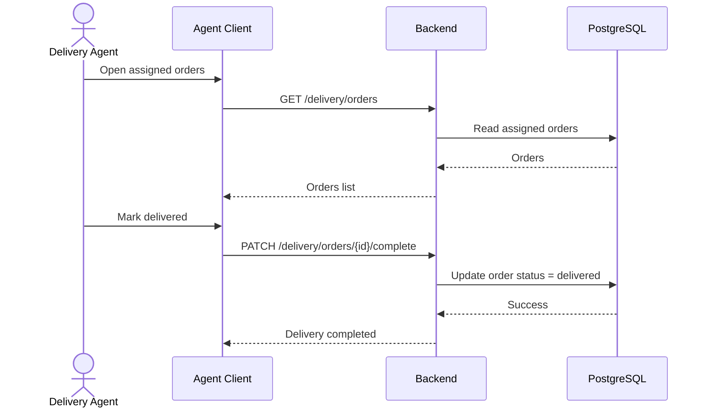
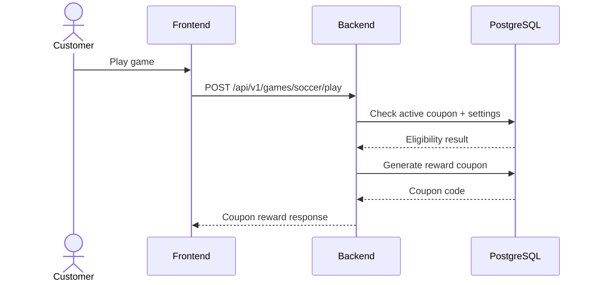

# Sequence Diagram

A sequence diagram shows **who talks to whom, and in what order**.
It is like a chat timeline between system parts.

## 1) Main Sequence (Customer places an order)

## 2) Split Sequence A (Payment with Razorpay)

## 3) Split Sequence B (Admin assigns delivery agent)

## 4) Split Sequence C (Delivery agent completes delivery)

## 5) Split Sequence D (Soccer game reward flow)

## Status legend

- <u>Implemented</u> = currently available in the repository.
- <u>Planned</u> = documented target, not fully implemented yet.

## Plain-language summary

<u>Customer ordering, admin assignment, delivery completion, and payment-reference workflow are implemented.</u>
<u>Soccer game reward sequence is implemented (including guest/mobile play endpoints).</u>
