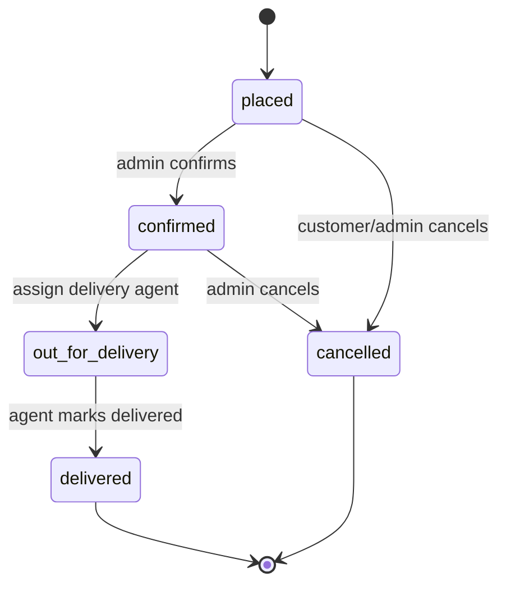
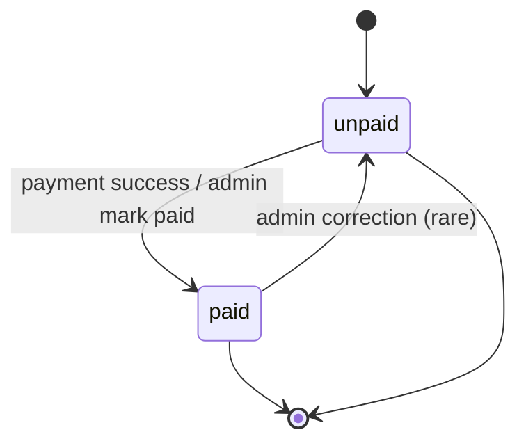
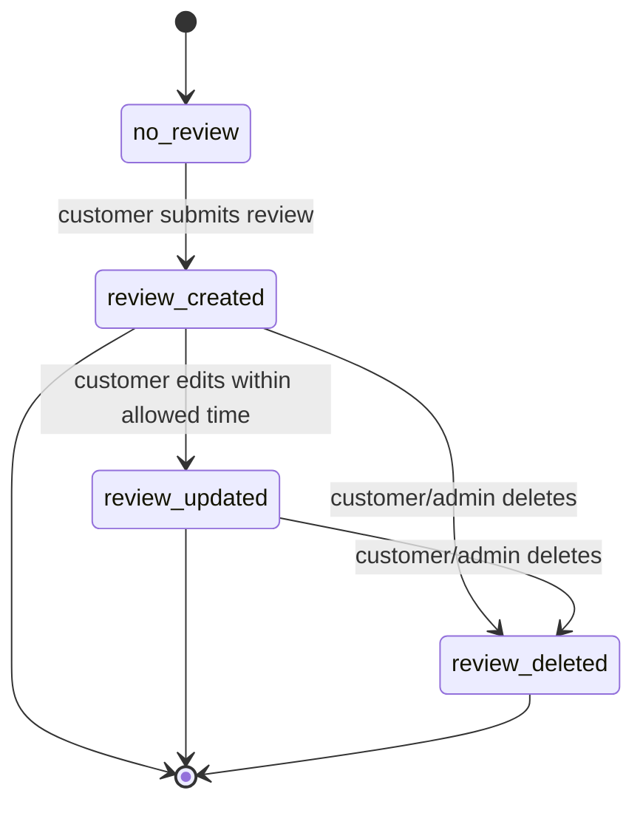
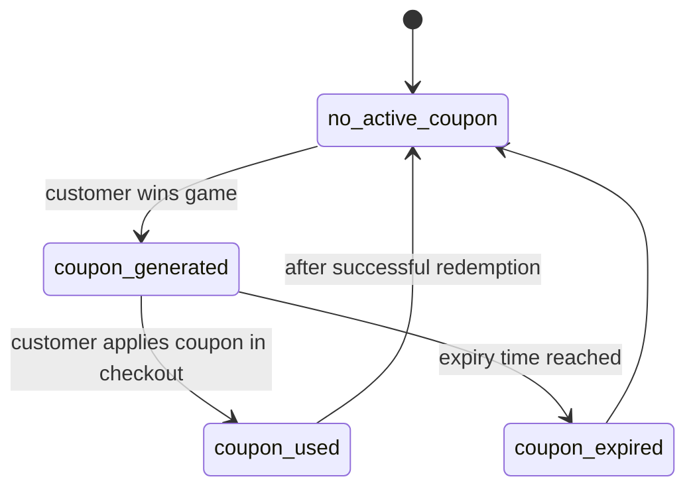

# State Machine Diagram

A state machine diagram shows how something changes from one **state** to another.
Think: "current status -> next status".

## 1) Main State Machine (Order Status)

## 2) Split State Machine A (Payment Status)

## 3) Split State Machine B (Review Lifecycle)

## 4) Split State Machine C (Planned Game Coupon Lifecycle)

## Status legend

- <u>Implemented</u> = available in current codebase.
- <u>Planned</u> = from planning PDFs, not fully implemented yet.

## Plain-language summary

<u>Order states and payment states are implemented and actively used in backend flows.</u>
<u>Review lifecycle (create/update/delete) is implemented.</u>
<u>Game coupon lifecycle states are planned and documented for future development.</u>
