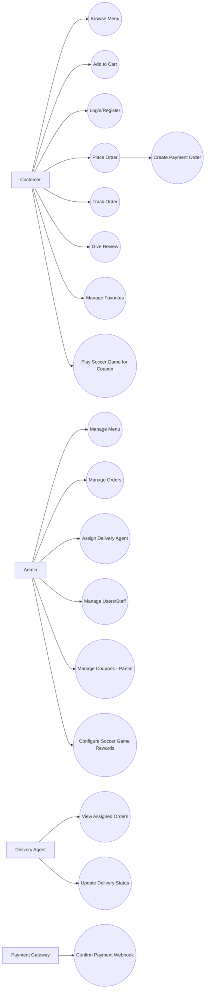
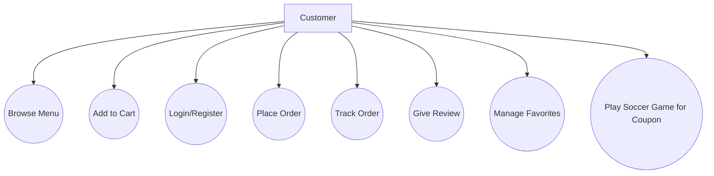
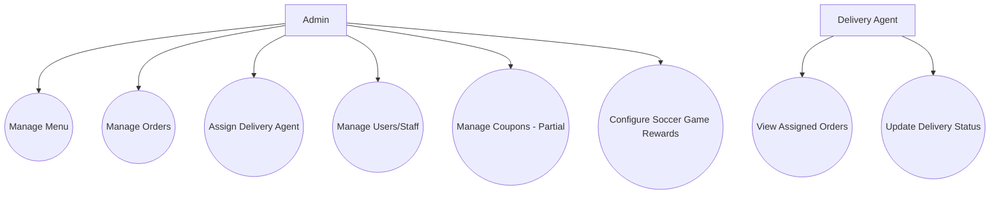

# Use Case Diagram

This document is intentionally simple so non-technical readers (age 10 to 40+) can understand it quickly.

## What is a Use Case Diagram?

A use case diagram shows:

- **who** uses the system (actors)
- **what** they can do (use cases)

Think of it as a "who does what" picture.

## Actors (People using the system)

- Customer
- Admin
- Delivery Agent
- Payment Gateway (Razorpay)

## Main Use Case Diagram (Current + Planned)

## Split Diagram A: Customer only (easy view)

## Split Diagram B: Admin + Delivery only (easy view)

## Status legend

- <u>Implemented</u> = available in current repo.
- <u>Planned</u> = in planning docs but not fully built yet.

## Plain-language summary

<u>Customers can browse food, order, track, review, and manage favorites in the current system.</u>
<u>Admins can manage menu, orders, and delivery assignment.</u>
<u>Delivery agents can view assigned orders and update delivery progress.</u>
<u>Soccer game reward and coupon validation flows are implemented.</u>
<u>Full advanced multi-game coupon workflows are not fully implemented.</u>
